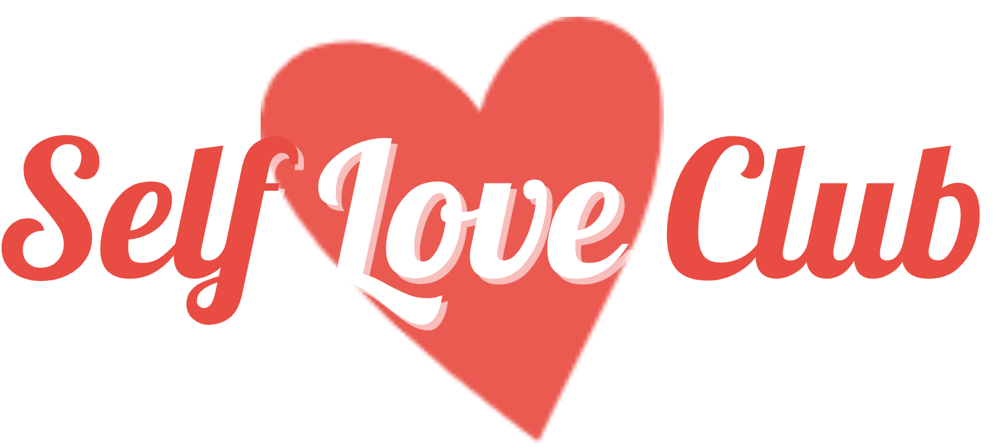
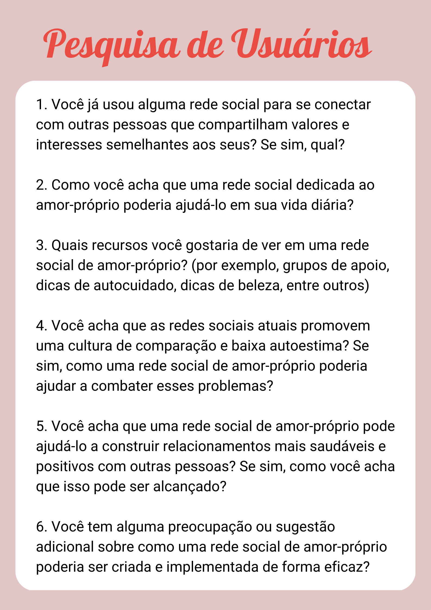
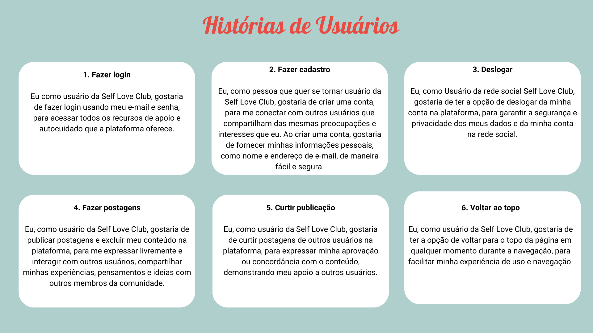
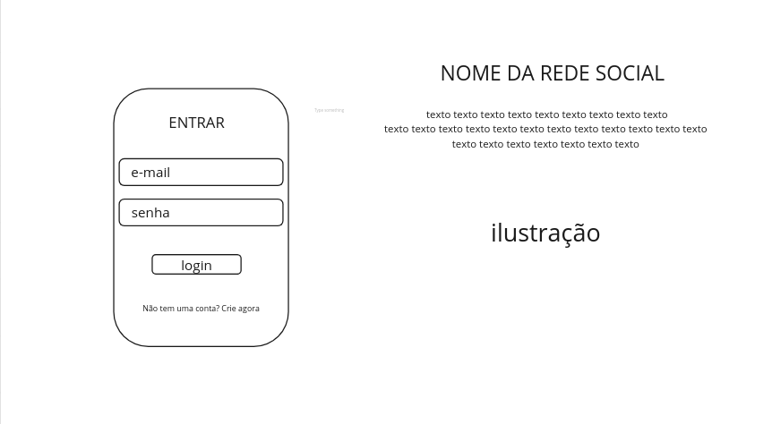
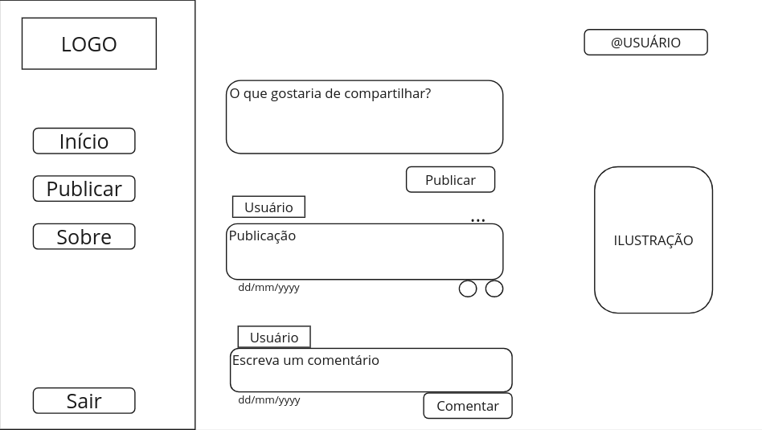

# Self Love Club

## Índice 
* [1. Definição do Projeto](#descrição-do-projeto) 
* [2. Pesquisa de Usuários](#pesquisa-de-usuários)
* [3. Histórias de Usuário](#histórias-de-usuário)
* [4. Prototipagem](#protótipos-do-projeto)
* * [4.1  Protótipo de Baixa Fidelidade](#protótipo-de-baixa-fidelidade)
* * [4.2 Protótipo de Alta Fidelidade](#protótipo-de-alta-fidelidade)
* [5.Funcionalidades](#funcionalidades)
*  [6. Acesso ao Projeto](#acesso-ao-projeto) 
* [7. Tecnologias utilizadas](#tecnologias-utilizadas) 
*  [8. Definição de Pronto](#definição-de-pronto)

***
## 1. Definição do projeto
 Projeto desenvolvido para o Bootcamp da [Laboratória](https://www.laboratoria.la/br). **"**Self Love Club"**** é uma rede social que fornece um ambiente seguro e acolhedor para que os usuários possam se expressar, compartilhar experiências e fortalecer sua autoestima.

O projeto consiste na criação de uma SPA (*Single-page Application*) responsiva, que permite aos usuários criar uma conta de acesso, fazer login, criar, excluir e curtir publicações. A SPA é composta por diversas páginas/telas, que serão acessíveis através de uma navegação intuitiva e fácil de usar, além de ter uma interface atraente e funcional que permite aos usuários navegar pelas diferentes seções da rede social com facilidade.

Em resumo, **"Self Love Club"** é uma rede social que tem como objetivo promover o amor-próprio e a autoestima dos usuários, através da criação de uma SPA responsiva e funcional, que permita a interação e o compartilhamento de experiências de forma segura e acolhedora.

## 2. Contexto

Nos dias atuais, as redes sociais são uma parte essencial da vida das pessoas em todo o mundo. Elas permitem que os indivíduos se conectem com amigos, familiares e comunidades com interesses semelhantes. No entanto, muitas redes sociais têm sido criticadas por promoverem uma cultura de comparação, competição e baixa autoestima.

Nesse contexto, muitas pessoas estão buscando alternativas para se conectarem com outras pessoas de maneira mais saudável e positiva. Diante disso, tive a ideia de desenvolver uma rede social dedicada ao amor-próprio e à autoaceitação, que oferece um ambiente seguro e acolhedor para os usuários compartilharem suas histórias de superação, experiências positivas, dicas de autocuidado, autoestima, desenvolvimento pessoal e saúde mental, criando assim, uma rede de apoio virtual que ajuda os usuários a construírem relacionamentos positivos e encorajadores.

## 3. Pesquisa de Usuários

Com base nesse contexto, realizei a seguinte pesquisa com supostos usuários da rede social:

## 4. Histórias de Usuários

Baseado no resultado do processo de pesquisa, criei as **Histórias de Usuários**, em que os  usuários são **pessoas que desejam ter uma relação mais amorosa e saudável consigo mesmas**. 

***
## 4.  Prototipagem

Primeiro, criei o Protótipo de Baixa Fidelidade na plataforma [Miro](https://miro.com/) onde depositamos e testamos nossas ideias inicias de design para o layout. Após as ideias terem sido testadas e refinadas, desenvolvemos o Protótipo de Alta Fidelidade na plataforma [Figma](www.figma.com), para avaliar a usabilidade e a aparência final do projeto antes de implementá-la, levando em consideração nossa pesquisa e histórias de usuário. 

### 4.1 Protótipos de Baixa Fidelidade

- Página de Login

- Timeline

### 4.2 Protótipo de Alta Fidelidade

## 5. Acesso ao Projeto
Você pode acessar o projeto clicando aqui.

## 6. Tecnologias utilizadas

 - JavaScript
 - HTML
 - CSS
 - Miro
 - Figma
 - Trello
 - Firebase
 - GIT
 - Jest
 - ESlint
 

## 7. Definição de pronto
 -  [x]  Ser uma SPA.
-   [x] Ser  _responsivo_.
-   [x] Receber  _code review_  de pelo menos uma parceira de outra equipe.
-   [] Fazer  _tests_  unitários.
-   [] Fazer testes manuais buscando erros e imperfeições simples.
-   [] Fazer testes de usabilidade e incorporar o  _feedback_  dos usuários como melhorias.
-   [] Fazer deploy do aplicativo e marcar a versão (git tag)